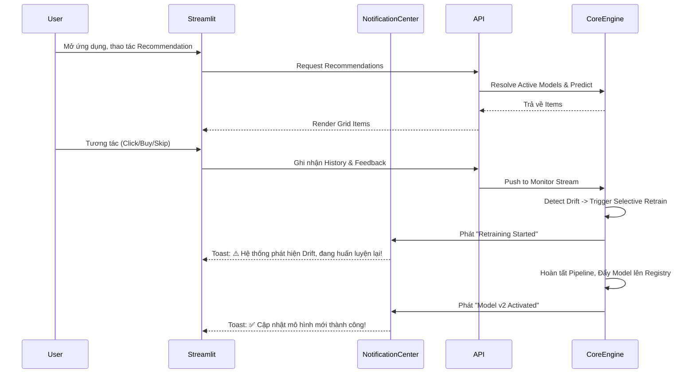
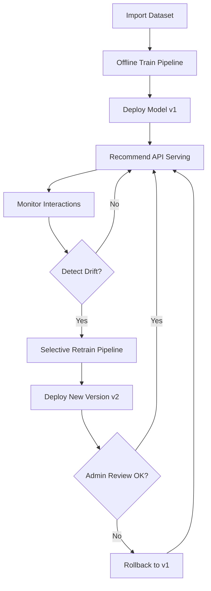
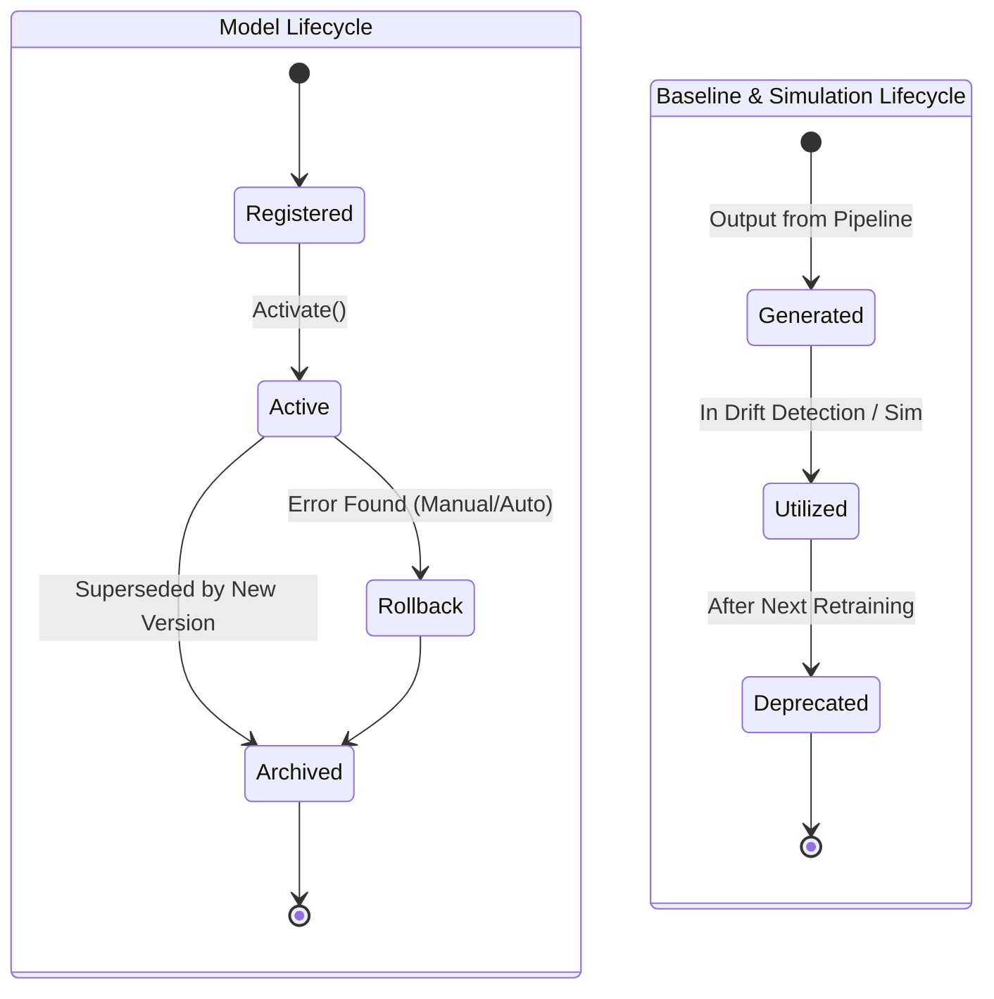
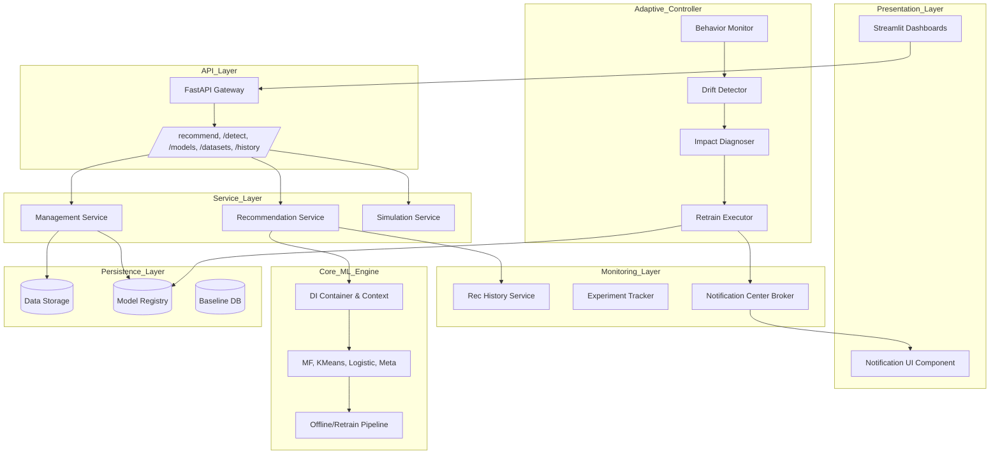
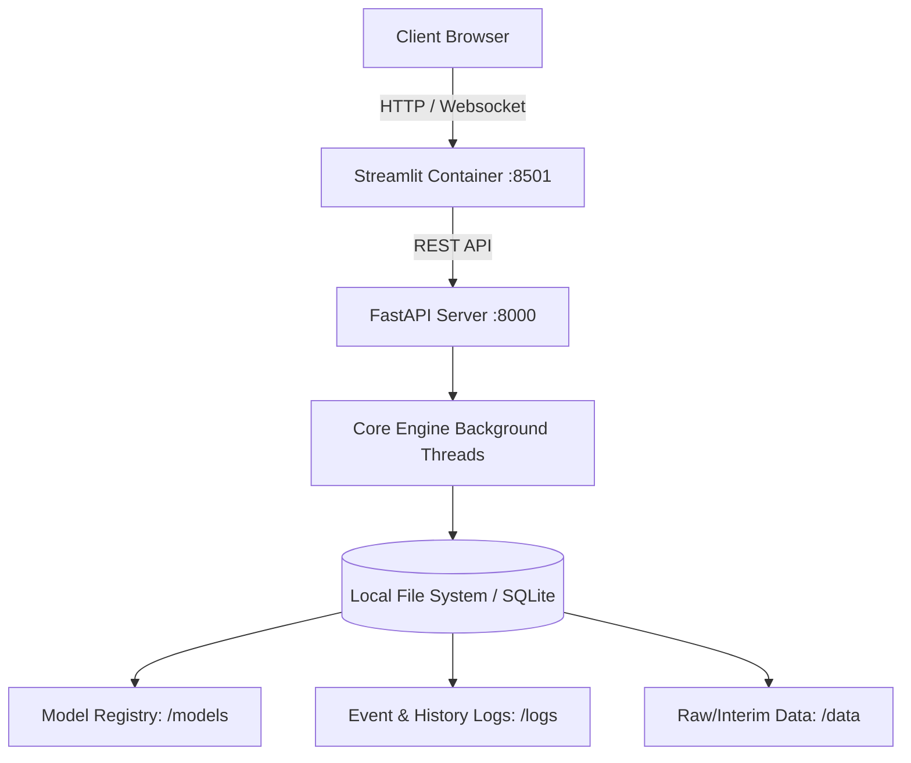

# Product-Grade Adaptive Hybrid Recommender Platform - Blueprint v5.0

## Assumptions & Design Principles
- **Core ML Engine Bất Biến**: Logic nghiên cứu, công thức toán học và các pipeline ML (SVD, KMeans, LR, Meta Learner) giữ nguyên 100%.
- **Product Completeness**: Nâng cấp từ "Sản phẩm Web" lên "Nền tảng (Platform) Recommendation toàn diện". Đóng gói trọn vẹn User Journeys, MLOps Lifecycles, Notification Center, và History Tracking.
- **Architectural Scope**: Mở rộng tầm nhìn của Product Architect và MLOps Architect, biến blueprint thành giải pháp End-to-End sẵn sàng thương mại hoá (Enterprise-ready) và có thể đem đi demo/pitching.

## User Review Required
> [!IMPORTANT]
> Đây là bản thiết kế Blueprint v5.0 cao cấp nhất (Platform-Level). Xin vui lòng duyệt qua các Màn hình Quản lý mới, Workflow MLOps, sơ đồ Lifecycle và Overall Product Architecture 7 Tầng trước khi chốt lại toàn bộ dự án.

---

## Phần 1: User Journeys & End-to-End Flow

### 1.1 User Journeys (Hành trình Người dùng)
Nền tảng phân quyền và phục vụ 3 nhóm đối tượng (Persona) chính:
- **End-user Journey**: Truy cập `Recommendation Page` -> Nhập ID -> Nhận gợi ý sản phẩm ngay lập tức -> Click/Bỏ qua. Hành vi được bắt lại bởi *History Service*. End-user hoàn toàn không biết hệ thống MLOps ngầm đang tự thích nghi ở bên dưới.
- **Admin/Operator Journey**: Truy cập `Model Management` và `Dataset Management`. Quản lý version dữ liệu và mô hình. Theo dõi `Evaluation Dashboard`. Nhận thông báo real-time từ `Notification Center` khi có thay đổi model và có quyền ấn nút `Rollback` khẩn cấp nếu model mới chạy sai.
- **Researcher Journey**: Truy cập `Drift Simulation` và `Drift Monitoring`. Inject các loại nhiễu (drift) để kiểm tra độ bền vững của thuật toán Adaptive Controller. Đọc báo cáo từ *Evaluation Reports* để viết paper.

### 1.2 End-to-End User Flow (App Open -> Adaptation)

---

## Phần 2: MLOps Business Workflow & Lifecycles

### 2.1 Business Workflow (Quy trình Vận hành Liên tục)
Mô tả quy trình từ lúc nạp dữ liệu đến lúc tự động cập nhật và xử lý rủi ro.

### 2.2 Lifecycle Diagrams (Vòng đời Artifacts)
Quản lý trạng thái sống của các đối tượng trong bộ nhớ/ổ cứng để tránh leak data.

---

## Phần 3: Product Platform Architecture

### 3.1 Overall Product Architecture Diagram
Bản đồ kiến trúc 7 tầng (7-Layer Architecture) khổng lồ, bao quát toàn bộ Platform.

### 3.2 Deployment Architecture
Cách thức ứng dụng được triển khai vật lý/tuyến tính.

---

## Phần 4: Bổ sung Dịch vụ & Màn hình Giao diện mới

### 4.1 Các Dịch vụ MLOps Mở rộng (System Services)
- **Recommendation History Service**: Mỗi request gợi ý sinh ra đều được lưu Database: `request_id`, `user_id`, `response_items_list`, `latency (ms)`, `timestamp`, `model_version`. Module này cung cấp data thiết yếu để tính Detection Delay và Audit hệ thống.
- **Notification Center**: Trạm trung chuyển thông báo bất đồng bộ (Websocket/Polling). Phát tín hiệu dạng Toast messages (Pop-up góc màn hình) lên Streamlit UI với các trạng thái:
  - ⚠️ *Drift Detected*
  - ⏳ *Retraining Started*
  - ✅ *Retraining Finished*
  - 🚀 *Model Activated*
  - 🔄 *Model Rollback*

### 4.2 Cấu trúc Trang Streamlit (Hoàn thiện 7 Pages)
Hệ thống UI nay bao gồm 7 trang chuyên biệt để phục vụ mọi User Journeys:
1. **Home Dashboard**: Tổng quan hệ thống.
2. **Recommendation Page**: Dành cho End-user xem gợi ý.
3. **Drift Monitoring**: Dành cho MLOps soi biểu đồ real-time.
4. **Drift Simulation**: Khu vực Lab tiêm (inject) dữ liệu giả.
5. **Evaluation Dashboard**: Đánh giá hiệu suất tổng hợp.
6. **[NEW] Model Management**: 
   - Truy xuất trực tiếp Model Registry.
   - Bảng liệt kê chi tiết các Model Version (v1, v2, v2.1-hotfix).
   - Hiển thị badge màu xanh lá cho mô hình đang `Current Active`.
   - Nút `Activate`, `Rollback` và `Archive` điều khiển thủ công cho quyền Admin.
7. **[NEW] Dataset Management**:
   - Quản lý Version của dữ liệu đầu vào.
   - Hiển thị Statistics tự động (Số users, items, density, sparsity).
   - Biểu đồ Time Range trải dài của dataset.
   - Badge hiển thị `Current Active Dataset` đang nạp trong RAM.
