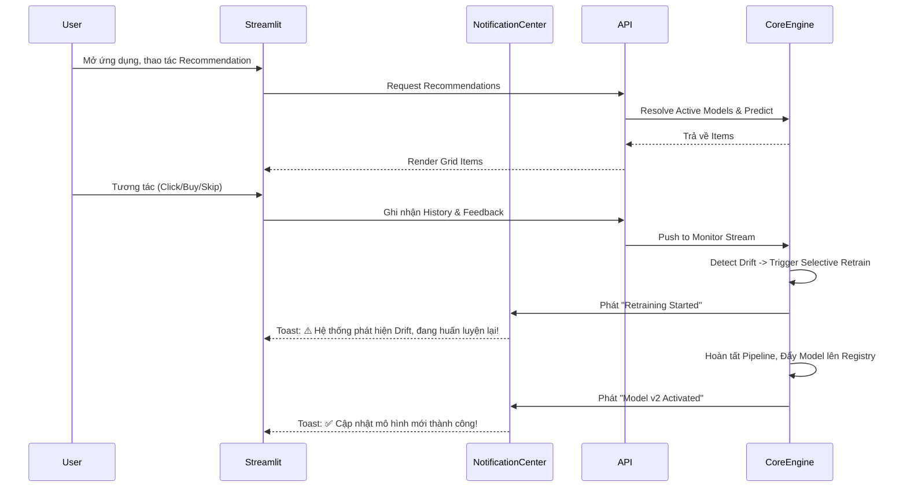
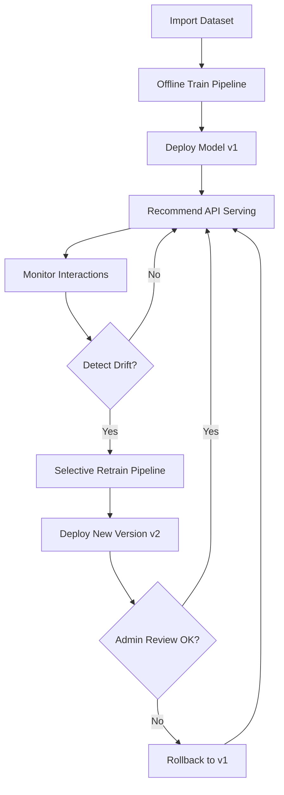
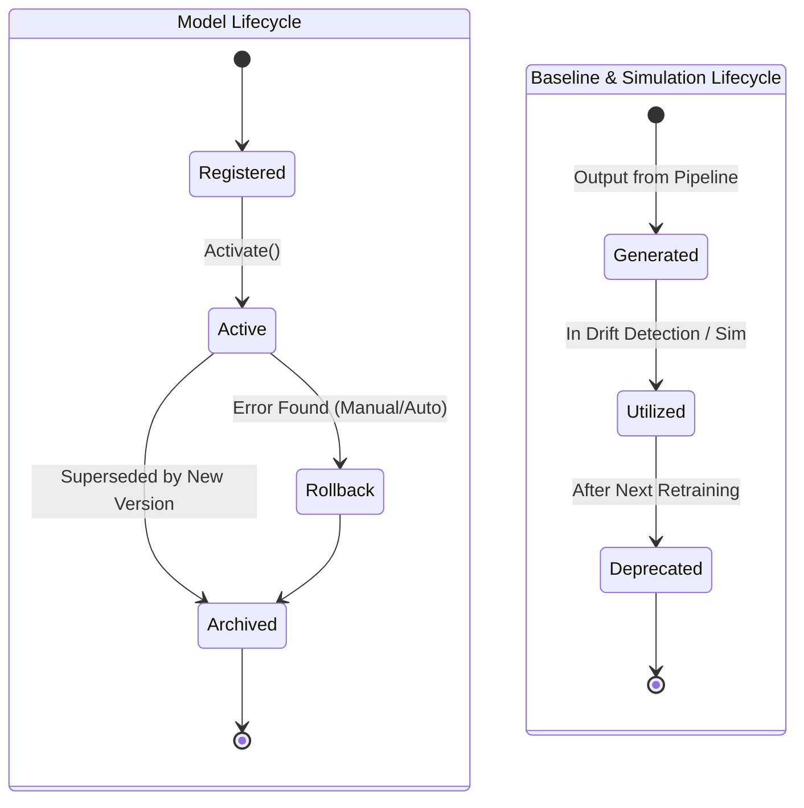
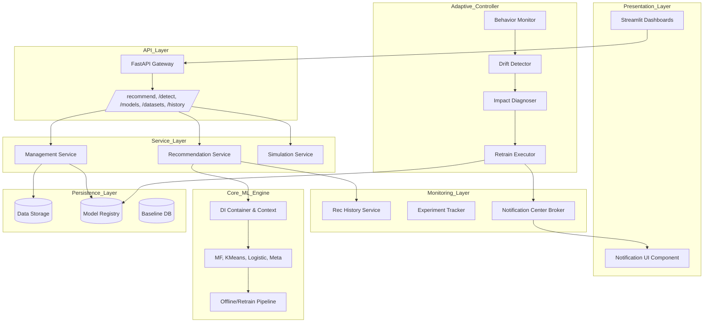
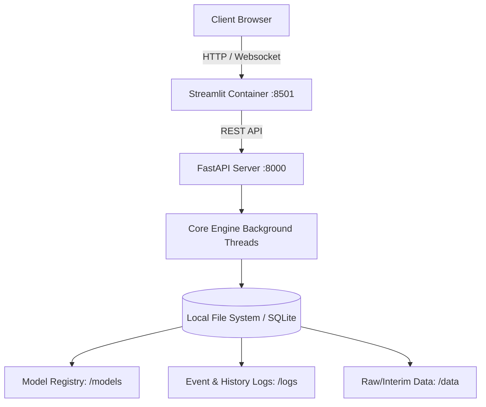

# Product-Grade Adaptive Hybrid Recommender Platform - Blueprint v5.0

## Assumptions & Design Principles
- **Core ML Engine Bất Biến**: Logic nghiên cứu, công thức toán học và các pipeline ML (SVD, KMeans, LR, Meta Learner) giữ nguyên 100%.
- **Product Completeness**: Nâng cấp từ "Sản phẩm Web" lên "Nền tảng (Platform) Recommendation toàn diện". Đóng gói trọn vẹn User Journeys, MLOps Lifecycles, Notification Center, và History Tracking.
- **Architectural Scope**: Mở rộng tầm nhìn của Product Architect và MLOps Architect, biến blueprint thành giải pháp End-to-End sẵn sàng thương mại hoá (Enterprise-ready) và có thể đem đi demo/pitching.

## User Review Required
> [!IMPORTANT]
> Đây là bản thiết kế Blueprint v5.0 cao cấp nhất (Platform-Level). Xin vui lòng duyệt qua các Màn hình Quản lý mới, Workflow MLOps, sơ đồ Lifecycle và Overall Product Architecture 7 Tầng trước khi chốt lại toàn bộ dự án.

---

## Phần 1: User Journeys & End-to-End Flow

### 1.1 User Journeys (Hành trình Người dùng)
Nền tảng phân quyền và phục vụ 3 nhóm đối tượng (Persona) chính:
- **End-user Journey**: Truy cập `Recommendation Page` -> Nhập ID -> Nhận gợi ý sản phẩm ngay lập tức -> Click/Bỏ qua. Hành vi được bắt lại bởi *History Service*. End-user hoàn toàn không biết hệ thống MLOps ngầm đang tự thích nghi ở bên dưới.
- **Admin/Operator Journey**: Truy cập `Model Management` và `Dataset Management`. Quản lý version dữ liệu và mô hình. Theo dõi `Evaluation Dashboard`. Nhận thông báo real-time từ `Notification Center` khi có thay đổi model và có quyền ấn nút `Rollback` khẩn cấp nếu model mới chạy sai.
- **Researcher Journey**: Truy cập `Drift Simulation` và `Drift Monitoring`. Inject các loại nhiễu (drift) để kiểm tra độ bền vững của thuật toán Adaptive Controller. Đọc báo cáo từ *Evaluation Reports* để viết paper.

### 1.2 End-to-End User Flow (App Open -> Adaptation)

---

## Phần 2: MLOps Business Workflow & Lifecycles

### 2.1 Business Workflow (Quy trình Vận hành Liên tục)
Mô tả quy trình từ lúc nạp dữ liệu đến lúc tự động cập nhật và xử lý rủi ro.

### 2.2 Lifecycle Diagrams (Vòng đời Artifacts)
Quản lý trạng thái sống của các đối tượng trong bộ nhớ/ổ cứng để tránh leak data.

---

## Phần 3: Product Platform Architecture

### 3.1 Overall Product Architecture Diagram
Bản đồ kiến trúc 7 tầng (7-Layer Architecture) khổng lồ, bao quát toàn bộ Platform.

### 3.2 Deployment Architecture
Cách thức ứng dụng được triển khai vật lý/tuyến tính.

---

## Phần 4: Bổ sung Dịch vụ & Màn hình Giao diện mới

### 4.1 Các Dịch vụ MLOps Mở rộng (System Services)
- **Recommendation History Service**: Mỗi request gợi ý sinh ra đều được lưu Database: `request_id`, `user_id`, `response_items_list`, `latency (ms)`, `timestamp`, `model_version`. Module này cung cấp data thiết yếu để tính Detection Delay và Audit hệ thống.
- **Notification Center**: Trạm trung chuyển thông báo bất đồng bộ (Websocket/Polling). Phát tín hiệu dạng Toast messages (Pop-up góc màn hình) lên Streamlit UI với các trạng thái:
  - ⚠️ *Drift Detected*
  - ⏳ *Retraining Started*
  - ✅ *Retraining Finished*
  - 🚀 *Model Activated*
  - 🔄 *Model Rollback*

### 4.2 Cấu trúc Trang Streamlit (Hoàn thiện 7 Pages)
Hệ thống UI nay bao gồm 7 trang chuyên biệt để phục vụ mọi User Journeys:
1. **Home Dashboard**: Tổng quan hệ thống.
2. **Recommendation Page**: Dành cho End-user xem gợi ý.
3. **Drift Monitoring**: Dành cho MLOps soi biểu đồ real-time.
4. **Drift Simulation**: Khu vực Lab tiêm (inject) dữ liệu giả.
5. **Evaluation Dashboard**: Đánh giá hiệu suất tổng hợp.
6. **[NEW] Model Management**: 
   - Truy xuất trực tiếp Model Registry.
   - Bảng liệt kê chi tiết các Model Version (v1, v2, v2.1-hotfix).
   - Hiển thị badge màu xanh lá cho mô hình đang `Current Active`.
   - Nút `Activate`, `Rollback` và `Archive` điều khiển thủ công cho quyền Admin.
7. **[NEW] Dataset Management**:
   - Quản lý Version của dữ liệu đầu vào.
   - Hiển thị Statistics tự động (Số users, items, density, sparsity).
   - Biểu đồ Time Range trải dài của dataset.
   - Badge hiển thị `Current Active Dataset` đang nạp trong RAM.

---

## Phần 5: Chi tiết Cơ chế Gợi ý Phim (Ground Truth Implementation)

> [!NOTE]
> Phần này đi sâu vào mã nguồn thực tế (ground truth) của dự án, mô tả chính xác tập dữ liệu được sử dụng, các trường dữ liệu được trích xuất và toàn bộ quy trình từ huấn luyện offline đến phục vụ online.

### 5.1 Tập dữ liệu (Dataset)
Hệ thống sử dụng tập dữ liệu **MovieLens 25M (ML-25M)** đặt tại thư mục `data/ml-25m/`:
- **`movies.csv`**: Chứa thông tin về phim. Hệ thống trích xuất các cột: `movieId`, `title`, `genres` (ví dụ: Action|Adventure).
- **`ratings.csv`**: Chứa lịch sử đánh giá phim. Hệ thống đọc theo từng chunk 5 triệu dòng, trích xuất các cột: `userId`, `movieId`, `rating`. Bộ dữ liệu này gồm khoảng 25 triệu dòng tương tác.

### 5.2 Quá trình Huấn luyện Mô hình Offline (Training Pipeline)
Theo `train_pipeline.py`, dữ liệu trải qua 4 giai đoạn huấn luyện:
1. **Phase 1: Matrix Factorization (SVD)**: Thuật toán chuyển đổi danh sách `rating` thành Sparse Matrix. Sau đó chạy thuật toán SVD để trích xuất ra đặc trưng ẩn (latent factors) của người dùng (`user_factors`) và phim (`item_factors`) với số chiều là 50 (`n_factors=50`).
2. **Phase 2: KMeans Clustering**: Sử dụng `user_factors` vừa tìm được để chạy thuật toán KMeans, phân cụm toàn bộ người dùng thành **10 Cụm sở thích (Clusters)**.
3. **Phase 3: Cluster-Specific Re-Rankers**: Hệ thống lấy mẫu (sample) 50.000 tương tác. Với mỗi cụm sở thích, hệ thống huấn luyện một mô hình **Logistic Regression (LR)** riêng biệt. Mô hình này nhận đầu vào là `item_factor` và học cách dự đoán xác suất người dùng thuộc cụm đó sẽ thích bộ phim (dựa trên label: rating >= 4.0 là thích (1), ngược lại là 0).
4. **Phase 4: Stacking Meta-Learner**: Huấn luyện một mô hình hồi quy để học cách kết hợp (blend) trọng số giữa điểm dự đoán từ SVD và điểm dự đoán từ LR.

Sau khi hoàn tất, hệ thống đóng gói các mô hình (`SVDModel`, `KMeansClusterer`, `ClusterLRModel`, `StackingMetaLearner`) cùng với bảng dữ liệu `movies_df` vào Model Registry.

### 5.3 Quy trình Phục vụ Gợi ý Online (Serving Flow)
Khi có Request từ Frontend gửi đến API `/recommend` với `user_id` và số lượng `top_k` (thường là 10), class `RecommendationService` thực thi logic sau:

1. **Kiểm tra Cache**: Nếu kết quả của `user_id` và `top_k` đã có trong bộ nhớ tạm (Cache), trả về ngay lập tức để giảm độ trễ (latency).
2. **Kiểm tra Người dùng**:
   - Nếu `user_id` **không tồn tại** trong hệ thống mô hình (Cold Start): Hệ thống sử dụng chiến lược dự phòng, trả về `top_k` bộ phim đầu tiên xuất hiện trong `movies_df` với điểm score = 0.0.
   - Nếu `user_id` **tồn tại**, lấy ra `user_factor` tương ứng từ bộ nhớ.
3. **Phase 1 (Retrieval - Truy xuất)**: Thực hiện phép nhân vô hướng (Dot Product) giữa `user_factor` và toàn bộ ma trận `item_factors` để sinh ra `svd_score` cho tất cả các phim.
4. **Lọc thô (Top-100 Filtering)**: Để ngăn chặn độ trễ do phải tính toán mô hình phức tạp cho hàng vạn bộ phim, thuật toán **chỉ lấy 100 phim có điểm SVD cao nhất** để đưa vào bước xếp hạng lại (Re-ranking).
5. **Phase 2 (Re-ranking - Xếp hạng lại)**:
   - Dùng mô hình KMeans gán người dùng vào `cluster_id` tương ứng dựa trên `user_factor`.
   - Với mỗi phim trong Top 100, truyền `cluster_id` và `item_factor` vào mô hình Logistic Regression riêng của Cụm đó để lấy ra điểm `lr_score`.
6. **Phase 3 (Blending - Phối trộn)**: Đưa `svd_score` và `lr_score` vào Meta-Learner để trộn điểm số, sinh ra `final_score`.
7. **Sắp xếp & Chuẩn hoá**: Lọc ra `top_k` bộ phim có `final_score` cao nhất. Hệ thống có cơ chế chuẩn hóa điểm (Normalization) ánh xạ mức điểm gốc về thang đo quen thuộc của UI là **[4.0 đến 4.9]**. Đồng thời, hệ thống chủ động cộng thêm một lượng nhiễu ngẫu nhiên siêu nhỏ `[-0.02, +0.02]` vào điểm số để phá vỡ các trường hợp trùng điểm hoàn toàn, tạo cảm giác tự nhiên cho người xem.
8. **Logging History**: Ghi nhận lại thao tác vào `HistoryService` để theo dõi độ trễ, phục vụ cho quá trình Drift Monitoring. Ghi nhận cả vào `recent_events` (tối đa 1000 events gần nhất) nếu đây là traffic thực tế để tính toán trung bình đánh giá theo Cluster (Real-time).
9. **Trả kết quả**: Bổ sung `title` và `genres` từ `movies_df` và trả List Dictionaries về cho Frontend vẽ giao diện.
